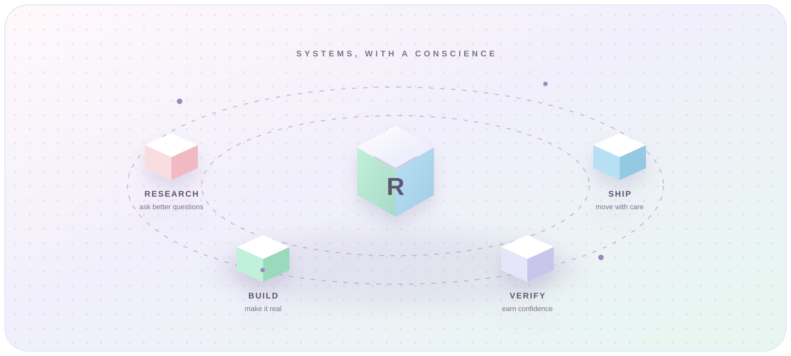
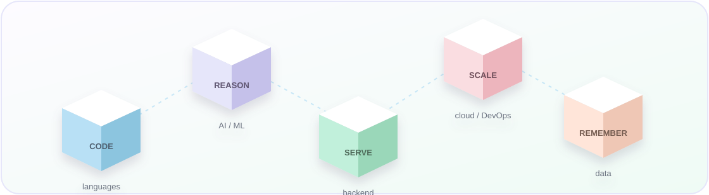

<!-- Profile README for github.com/riyaayay -->

<div align="center">
  

  

  <a href="https://github.com/riyaayay">
    
  </a>

  <p><i>Turning curious questions into reliable systems—one thoughtful experiment at a time.</i></p>
</div>

<!-- Section: About -->

## A little about me

### My north star

> I like systems that are ambitious enough to be interesting—and honest enough to deserve trust.

- I’m a Computer Science engineer—B.Tech AI & ML at VIT Bhopal, alongside a Data Science dual degree at IIT Madras.
- I build AI systems that know when they cannot be trusted: RAG pipelines with hallucination-verifier agents, not just API wrappers.
- I’m equally drawn to real-time systems, safety-critical control, and the cloud/GPU infrastructure underneath the magic.
- Shortlisted for Amazon ML Summer School—one of 3,000 selected from 134,000+ applicants.
- Currently a Full-Stack Software Engineering Intern; previously shipped an AI/Deep Learning internship at a government DAE facility.

### The way I think about systems

| Ask | Build | Verify | Ship |
|:---:|:---:|:---:|:---:|
| Find the failure mode early. | Make the smallest useful thing real. | Measure what confidence is earned. | Put it where it can matter. |

<!-- Section: Projects -->

## Things I’m building

<p align="center"><i>From trustworthy intelligence to systems that make a measurable dent.</i></p>

### The build loop

```text
signal ──► model ──► decision ──► safeguard ──► measurable outcome
             │                         │
          intelligence              responsibility
```

### Selected systems

|  |  |
|:---|:---|
| **[VoltAgent](https://github.com/riyaayay/voltagent)**<br><br>Self-critiquing RAG with a hallucination-verifier agent. Hybrid retrieval improved Recall@6 by 20 points; the verifier caught 8/10 deliberately wrong test answers.<br><br>     | **[Gridlock 2.0](https://github.com/riyaayay/gridlock-2-0)**<br><br>Spatio-temporal traffic demand forecasting for the Flipkart GRID Challenge: tree ensembles + a PyTorch TCN, trained on an NVIDIA A100 GPU on GCP across 77K+ records and 1,249 regions.<br><br>     |
| **[Autonomous Production Choke Controller](https://github.com/riyaayay/autonomous-production-choke-controller)**<br><br>Uncertainty-aware Model Predictive Control for the Honeywell Campus Hackathon. A data-driven constraint back-off reduced safety violations from 42/70 to 0/196.<br><br>   | **[PolarSolarNet](https://github.com/riyaayay/polarsolarnet)**<br><br>Coordinate-aware CNN for HALO CME detection, submitted to ACM Multimedia 2026. AUC 0.948 across 27 years of solar data, with the domain’s lowest published false-alarm rate.<br><br>  |
| **[NYAYA](https://github.com/riyaayay/nyaya)**<br><br>AI compliance and bias-auditing platform: Pearson, VIF, and SHAP analysis over 1M+ records, built as role-differentiated microservices.<br><br>     | **[TaskFlow](https://github.com/riyaayay/taskflow)**<br><br>Production-style RESTful task-management API, designed with 90%+ unit-test coverage.<br><br>    |

<!-- Section: Stack -->

## My toolkit

### A stack with shape

<p align="center"></p>

<p align="center"><i>Each layer exists to take a useful idea from signal to production.</i></p>

<div align="center">

**Languages**<br>
    

**AI / ML**<br>
   

**Backend**<br>
  

**Cloud / DevOps**<br>
   

**Databases**<br>
   

</div>

<!-- Section: GitHub Stats -->

## A small window into my GitHub

### Open-source pulse

<p align="center"><i>Live signals from the work in progress.</i></p>

<div align="center">
  <a href="https://github.com/riyaayay">
    
  </a>
  <a href="https://github.com/riyaayay">
    
  </a>
  <br>
  <a href="https://github.com/riyaayay">
    
  </a>
</div>

<!-- Section: Connect -->

## Let’s build something useful

<p align="center"><i>If you care about reliable AI, real-world systems, or simply making complex things feel calm, I’d love to connect.</i></p>

<p align="center">
  <a href="https://www.linkedin.com/in/riya-rathod-75651a282"></a>
  <a href="mailto:riyarathod415@gmail.com"></a>
</p>

<div align="center">
  
</div>
